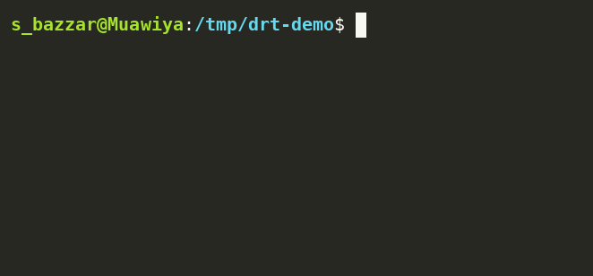

[English](./README.md) | [日本語](./README.ja.md)

<picture>
  <source media="(prefers-color-scheme: dark)" srcset="https://raw.githubusercontent.com/drt-hub/.github/main/profile/assets/logo-dark.svg">
  
</picture>

# drt — data reverse tool

> Reverse ETL for the code-first data stack.

[](https://github.com/drt-hub/drt/actions/workflows/ci.yml)
[](https://codecov.io/gh/drt-hub/drt)
[](https://pypi.org/project/drt-core/)
[](https://pepy.tech/projects/drt-core)
[](https://pepy.tech/projects/dagster-drt)
[](LICENSE)
[](https://pypi.org/project/drt-core/)

**drt** syncs data from your data warehouse to external services — declaratively, via YAML and CLI.
Think `dbt run` → `drt run`. Same developer experience, opposite data direction.

<p align="center">
  
</p>

```bash
pip install drt-core          # core (DuckDB included)
drt init && drt run
```

---

## Why drt?

| Problem | drt's answer |
|---------|-------------|
| Census/Hightouch are expensive SaaS | Free, self-hosted OSS |
| GUI-first tools don't fit CI/CD | CLI + YAML, Git-native |
| dbt/dlt ecosystem has no reverse leg | Same philosophy, same DX |
| LLM/MCP era makes GUI SaaS overkill | LLM-native by design |

---

## Quickstart

No cloud accounts needed — runs locally with DuckDB in about 5 minutes.

### 1. Install

```bash
pip install drt-core
```

> For cloud sources: `pip install drt-core[bigquery]`, `drt-core[postgres]`, etc.

### 2. Set up a project

```bash
mkdir my-drt-project && cd my-drt-project
drt init   # select "duckdb" as source
```

### 3. Create sample data

```bash
python -c "
import duckdb
c = duckdb.connect('warehouse.duckdb')
c.execute('''CREATE TABLE IF NOT EXISTS users AS SELECT * FROM (VALUES
  (1, 'Alice', 'alice@example.com'),
  (2, 'Bob',   'bob@example.com'),
  (3, 'Carol', 'carol@example.com')
) t(id, name, email)''')
c.close()
"
```

### 4. Create a sync

```yaml
# syncs/post_users.yml
name: post_users
description: "POST user records to an API"
model: ref('users')
destination:
  type: rest_api
  url: "https://httpbin.org/post"
  method: POST
  headers:
    Content-Type: "application/json"
  body_template: |
    { "id": {{ row.id }}, "name": "{{ row.name }}", "email": "{{ row.email }}" }
sync:
  mode: full
  batch_size: 1
  on_error: fail
```

### 5. Run

```bash
drt run --dry-run   # preview, no data sent
drt run             # run for real
drt status          # check results
```

> See [examples/](examples/) for more: Slack, Google Sheets, HubSpot, GitHub Actions, etc.

---

## CLI Reference

```bash
drt init                    # initialize project
drt list                    # list sync definitions
drt run                     # run all syncs
drt run --select <name>     # run a specific sync
drt run --dry-run           # dry run
drt run --verbose           # show row-level error details
drt validate                # validate sync YAML configs
drt status                  # show recent sync status
drt status --verbose        # show per-row error details
drt mcp run                 # start MCP server (requires drt-core[mcp])
```

---

## MCP Server

Connect drt to Claude, Cursor, or any MCP-compatible client so you can run syncs, check status, and validate configs without leaving your AI environment.

```bash
pip install drt-core[mcp]
drt mcp run
```

**Claude Desktop** (`~/Library/Application Support/Claude/claude_desktop_config.json`):

```json
{
  "mcpServers": {
    "drt": {
      "command": "drt",
      "args": ["mcp", "run"]
    }
  }
}
```

**Available MCP tools:**

| Tool | What it does |
|------|-------------|
| `drt_list_syncs` | List all sync definitions |
| `drt_run_sync` | Run a sync (supports `dry_run`) |
| `drt_get_status` | Get last run result(s) |
| `drt_validate` | Validate sync YAML configs |
| `drt_get_schema` | Return JSON Schema for config files |

---

## AI Skills for Claude Code

Install the official Claude Code skills to generate YAML, debug failures, and migrate from other tools — all from the chat interface.

### Install via Plugin Marketplace (recommended)

```bash
/plugin marketplace add drt-hub/drt
/plugin install drt@drt-hub
```

> **Tip:** Enable auto-update so you always get the latest skills when drt is updated:
> `/plugin` → Marketplaces → drt-hub → Enable auto-update

### Manual install (slash commands)

Copy the files from `.claude/commands/` into your drt project's `.claude/commands/` directory.

| Skill | Trigger | What it does |
|-------|---------|-------------|
| `/drt-create-sync` | "create a sync" | Generates valid sync YAML from your intent |
| `/drt-debug` | "sync failed" | Diagnoses errors and suggests fixes |
| `/drt-init` | "set up drt" | Guides through project initialization |
| `/drt-migrate` | "migrate from Census" | Converts existing configs to drt YAML |

---

## Connectors

| Type | Name | Status | Install |
|------|------|--------|---------|
| **Source** | BigQuery | ✅ v0.1 | `pip install drt-core[bigquery]` |
| **Source** | DuckDB | ✅ v0.1 | (core) |
| **Source** | PostgreSQL | ✅ v0.1 | `pip install drt-core[postgres]` |
| **Source** | Snowflake | 🗓 planned | `pip install drt-core[snowflake]` |
| **Source** | SQLite | ✅ v0.4.2 | (core) |
| **Source** | Redshift | ✅ v0.3.4 | `pip install drt-core[redshift]` |
| **Source** | ClickHouse | ✅ v0.4.3 | `pip install drt-core[clickhouse]` |
| **Source** | MySQL | 🗓 planned | `pip install drt-core[mysql]` |
| **Destination** | REST API | ✅ v0.1 | (core) |
| **Destination** | Slack Incoming Webhook | ✅ v0.1 | (core) |
| **Destination** | Discord Webhook | ✅ v0.4.2 | (core) |
| **Destination** | GitHub Actions (workflow_dispatch) | ✅ v0.1 | (core) |
| **Destination** | HubSpot (Contacts / Deals / Companies) | ✅ v0.1 | (core) |
| **Destination** | Google Sheets | ✅ v0.4 | `pip install drt-core[sheets]` |
| **Destination** | PostgreSQL (upsert) | ✅ v0.4 | `pip install drt-core[postgres]` |
| **Destination** | MySQL (upsert) | ✅ v0.4 | `pip install drt-core[mysql]` |
| **Destination** | CSV / JSON file | 🗓 v0.5 | (core) |
| **Destination** | Salesforce | 🗓 v0.6 | `pip install drt-core[salesforce]` |
| **Destination** | Notion | 🗓 planned | (core) |
| **Destination** | Linear | 🗓 planned | (core) |
| **Destination** | SendGrid | 🗓 planned | (core) |
| **Integration** | Dagster | ✅ v0.4 | `pip install dagster-drt` |
| **Integration** | Airflow | 🗓 v0.6 | `pip install airflow-drt` |
| **Integration** | dbt manifest reader | ✅ v0.4 | (core) |

---

## Roadmap

> **Detailed plans & progress → [GitHub Milestones](https://github.com/drt-hub/drt/milestones)**
> **Looking to contribute? → [Good First Issues](https://github.com/drt-hub/drt/issues?q=is%3Aopen+label%3A%22good+first+issue%22)**

| Version | Focus |
|---------|-------|
| **v0.1** ✅ | BigQuery / DuckDB / Postgres sources · REST API / Slack / GitHub Actions / HubSpot destinations · CLI · dry-run |
| **v0.2** ✅ | Incremental sync (`cursor_field` watermark) · retry config per-sync |
| **v0.3** ✅ | MCP Server (`drt mcp run`) · AI Skills for Claude Code · LLM-readable docs · row-level errors · security hardening · Redshift source |
| **v0.4** ✅ | Google Sheets / PostgreSQL / MySQL destinations · dagster-drt · dbt manifest reader · type safety overhaul |
| [v0.5](https://github.com/drt-hub/drt/milestone/2) | Snowflake source · CSV/JSON + Parquet destinations · test coverage · Docker |
| [v0.6](https://github.com/drt-hub/drt/milestone/3) | Salesforce · Airflow integration · Jira / Twilio / Intercom destinations |
| [v0.7](https://github.com/drt-hub/drt/milestone/4) | DWH destinations (Snowflake / BigQuery / ClickHouse / Databricks) · Cloud storage (S3 / GCS / Azure Blob) |
| [v0.8](https://github.com/drt-hub/drt/milestone/5) | Lakehouse sources (Delta Lake / Apache Iceberg) |
| v1.x | Rust engine (PyO3) |

---

## Orchestration: dagster-drt

Community-maintained [Dagster](https://dagster.io/) integration. Expose drt syncs as Dagster assets with full observability.

```bash
pip install dagster-drt
```

```python
from dagster import AssetExecutionContext, Definitions
from dagster_drt import drt_assets, DagsterDrtResource

@drt_assets(project_dir="path/to/drt-project")
def my_syncs(context: AssetExecutionContext, drt: DagsterDrtResource):
    yield from drt.run(context=context)

defs = Definitions(
    assets=[my_syncs],
    resources={"drt": DagsterDrtResource(project_dir="path/to/drt-project")},
)
```

See [dagster-drt README](integrations/dagster-drt/README.md) for full API docs (Translator, Pipes support, DrtConfig dry-run, MaterializeResult).

---

## Ecosystem

drt is designed to work alongside, not against, the modern data stack:

<p align="center">
  
</p>

---

## Contributing

See [CONTRIBUTING.md](CONTRIBUTING.md).

## Disclaimer

drt is an independent open-source project and is **not affiliated with,
endorsed by, or sponsored by** dbt Labs, dlt-hub, or any other company.

"dbt" is a registered trademark of dbt Labs, Inc.
"dlt" is a project maintained by dlt-hub.

drt is designed to complement these tools as part of the modern data stack,
but is a separate project with its own codebase and maintainers.

## License

Apache 2.0 — see [LICENSE](LICENSE).
